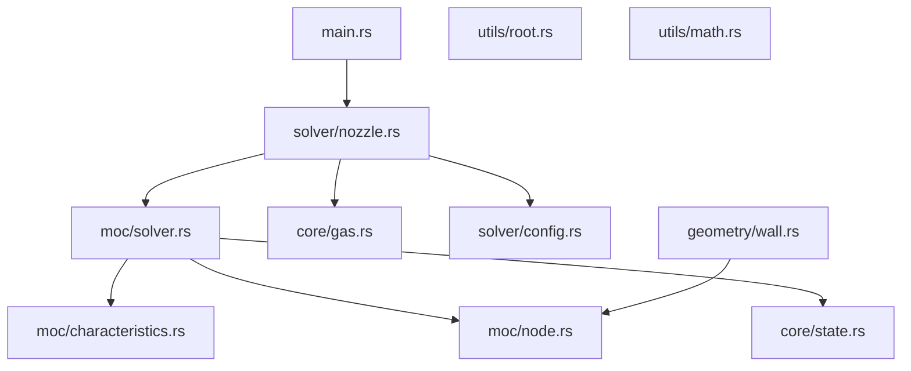

# MOC Nozzle Design — Project Overview

This project is a Rust implementation of a 2D Method of Characteristics (MOC) bell nozzle design tool. Given a specific heat ratio γ and an exit-to-throat area ratio A_e/A*, it is intended to compute the supersonic contour of a minimum-length nozzle that produces uniform, parallel, shock-free flow at the exit plane.

---

## Architecture

---

## Source File Status

| File | Status | Description | Issues |
|------|--------|-------------|--------|
| `core/gas.rs` | 🟡 Partial | Defines `GasModel` trait and `Air` struct; Prandtl-Meyer forward formula is mathematically correct | **Bug 1**: multiplies by `180/PI` so returns **degrees**, but all downstream code assumes radians. **Bug 2**: `inverse_prandtl_meyer` uses broken fixed-step gradient descent (step=0.01), will diverge for large ν |
| `core/state.rs` | 🟢 Complete | `FlowState { m, theta, nu }` — correct data structure | None |
| `moc/characteristics.rs` | 🟡 Partial | `invariants()` and `from_invariants()` algebra is correct (K+ = θ+ν, K− = θ−ν) | Mach number is hardcoded to `2.0` placeholder in `from_invariants`; never recovered from ν via inverse PM |
| `moc/node.rs` | 🟢 Complete | `Node { x, y, state }` — correct | None |
| `moc/solver.rs` | 🔴 Dummy | `initialize()` generates synthetic nodes with linear θ at y=0, x=i; `step()` averages positions and adds 0.1 to y with no real physics | Entire file is placeholder — no real throat expansion fan, no real characteristic intersection, no wall or axis boundary conditions |
| `solver/config.rs` | 🟡 Partial | `gamma`, `ae_at`, `n_points` | Missing `throat_radius`; `n_points` is ambiguous — should be `n_chars` (number of characteristic lines); no exit Mach field (derived from `ae_at` but no code does this) |
| `solver/nozzle.rs` | 🔴 Stub | `run()` calls `initialize()` then loops `step()` 5 times | Never uses `gas` or `ae_at`; no orchestration; just exercises the dummy solver |
| `geometry/wall.rs` | 🔴 Wrong | `extract_wall()` filters nodes where `y >= 0.5` — a hardcoded threshold | Completely wrong: the wall contour is not a y-threshold filter; it must track the specific wall-side nodes in the characteristic mesh |
| `utils/math.rs` | 🟢 Complete | `clamp(x, a, b)` | None |
| `utils/root.rs` | 🟡 Partial | `bisection(f, a, b)` runs 50 iterations | No convergence tolerance check; bracket [1.0+ε, 50.0] must be provided by caller; no Newton-Raphson option |

---

## Known Bugs

1. **`core/gas.rs` `prandtl_meyer()`** — returns degrees not radians. The final `* 180.0 / PI` must be removed; all downstream MOC algebra operates in radians.
2. **`core/gas.rs` `inverse_prandtl_meyer()`** — gradient descent with a fixed step of 0.01 will not converge reliably for large ν values; should use the existing `bisection()` from `utils/root.rs`.
3. **`moc/characteristics.rs` `from_invariants()`** — Mach number is set to the hardcoded literal `2.0`; must call `gas.inverse_prandtl_meyer(nu)` to recover the correct M from the computed ν.
4. **`moc/solver.rs` `initialize()`** — generates fake node data that is entirely unrelated to the design exit Mach number or area ratio.
5. **`moc/solver.rs` `step()`** — geometry computed as a simple positional midpoint plus a 0.1 y-offset; this is not a real characteristic intersection and produces physically meaningless results.
6. **`geometry/wall.rs` `extract_wall()`** — filtering nodes by `y >= 0.5` is a hardcoded heuristic with no physical meaning; the wall contour must be extracted from the actual wall-side nodes accumulated during the MOC mesh march.

---

## What Is Missing

1. **Area-Mach relation solver** — converts `ae_at` to the exit Mach number `M_e` that the nozzle is designed to produce.
2. **Correct Prandtl-Meyer inversion** — robustly recovers M from ν using the bisection root-finder rather than gradient descent.
3. **Initial data line (throat expansion fan)** — generates the first set of characteristic nodes from the throat using simple-wave theory (θ = ν, K⁻ = 0) to seed the MOC mesh.
4. **Interior point characteristic intersection** — given two neighboring nodes on adjacent left- and right-running characteristics, find the physical (x, y) intersection point and compute the new flow state from the Riemann invariants.
5. **Axis boundary condition** — when a characteristic reaches the symmetry axis (y = 0), enforce θ = 0 and derive ν from the incoming K⁺ invariant.
6. **Wall boundary condition** — the nozzle wall is a streamline; for a minimum-length nozzle the wall contour is an *output* of the MOC, not a prescribed input.
7. **Exit condition check** — the marching loop must stop when the exit Mach equals M_e or when the final centerline node reaches the design condition.
8. **Proper contour extraction** — collect the sequence of wall-side nodes in physical (x, y) order to form the nozzle wall profile.
9. **Convergent section** — the subsonic converging portion from the combustion chamber to the throat is not computed by MOC; it is typically designed using circular arcs or Bézier curves.

---

## Suggested Implementation Order

1. Fix `prandtl_meyer()` → remove the degree conversion (`* 180.0 / PI`).
2. Fix `inverse_prandtl_meyer()` → replace gradient descent with a call to `bisection()`.
3. Add `area_mach_ratio()` and `mach_from_area_ratio()` to `GasModel` in `core/gas.rs`.
4. Fix `from_invariants()` → recover M by calling `gas.inverse_prandtl_meyer(nu)`.
5. Add an `interior_point()` function in `moc/characteristics.rs` that computes the real characteristic intersection.
6. Add `axis_point()` and `wall_point()` functions for the two boundary conditions.
7. Rewrite `moc/solver.rs` `initialize()` using the throat expansion fan.
8. Rewrite `moc/solver.rs` step logic to march the real characteristic mesh using `interior_point()`, `axis_point()`, and `wall_point()`.
9. Rewrite `solver/nozzle.rs` to orchestrate the full design: compute M_e, build the mesh, extract the wall.
10. Rewrite `geometry/wall.rs` to extract the wall contour from the accumulated wall-side nodes.
11. Implement the convergent section in a new file `geometry/convergent.rs`.

---

## Documentation Index

### Baseline Solver (V0)

| File | Topic |
|------|-------|
| [`01_isentropic_flow.md`](01_isentropic_flow.md) | Isentropic flow physics, speed of sound, Area-Mach relation |
| [`02_prandtl_meyer.md`](02_prandtl_meyer.md) | Prandtl-Meyer function: physics, formula, current bugs, fixes |
| [`03_moc_theory.md`](03_moc_theory.md) | Method of Characteristics theory: characteristics, compatibility equations, Riemann invariants |
| [`04_nozzle_design.md`](04_nozzle_design.md) | Full MOC nozzle design procedure step by step |
| [`05_implementation_guide.md`](05_implementation_guide.md) | Rust implementation guide for each missing piece |
| [`06_convergent_section.md`](06_convergent_section.md) | Convergent section design (subsonic portion) |

### Enhancement Roadmap (V1–V5)

| File | Version | Topic |
|------|---------|-------|
| [`07_enhancements_roadmap.md`](07_enhancements_roadmap.md) | Overview | Accuracy vs. effort table, recommended priority order, what each version teaches |
| [`08_v1_axisymmetric_moc.md`](08_v1_axisymmetric_moc.md) | V1 | Axisymmetric cylindrical source term — correct geometry for real nozzles |
| [`09_v2_variable_gamma.md`](09_v2_variable_gamma.md) | V2 | NASA-7 polynomials: Cp(T), Cv(T), γ(T) across the expansion |
| [`10_v3_frozen_flow_chemistry.md`](10_v3_frozen_flow_chemistry.md) | V3 | Frozen-flow chemistry: CEA integration, real combustion gas properties |
| [`11_v4_boundary_layer.md`](11_v4_boundary_layer.md) | V4 | Boundary-layer displacement correction: δ*(x), throat area reduction |
| [`12_v5_cfd_validation.md`](12_v5_cfd_validation.md) | V5 | CFD validation: SU2/OpenFOAM setup, mesh export, failure-mode diagnostics |
