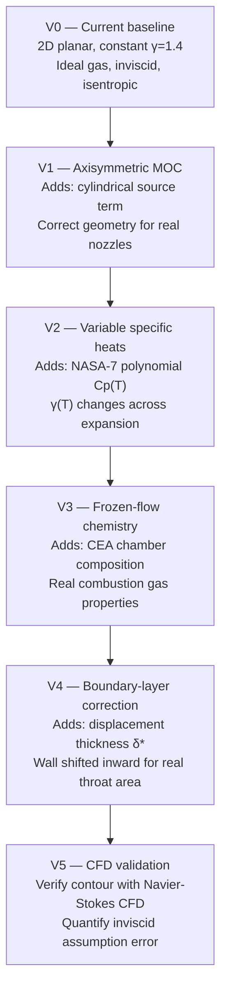

# Enhancement Roadmap — Toward a Realistic Nozzle Solver

This document describes the planned evolution of the MOC nozzle solver from its
current idealized baseline (V0) through progressively more physical models. Each
version adds one layer of physics, is testable on its own, and builds toward a
solver accurate enough to inform real hardware design.

---

## Why Simplifications Matter

The baseline solver documented in `01` through `06` is a genuine, working
implementation of the Method of Characteristics. It produces a nozzle contour
that satisfies supersonic flow without shocks, and for modest expansion ratios
it gives reasonable performance estimates. But it also carries a set of
assumptions that introduce real, quantifiable errors.

### What V0 Gets Right

| Aspect | Status |
|--------|--------|
| Nozzle contour shape (topology) | Correct within its assumptions |
| Shock-free supersonic expansion | Correct by construction (MOC is exact for this) |
| Isentropic, ideal-gas framework | Self-consistent |
| Approximate Isp for low area ratios (A_e/A* ≤ 4) | Acceptable (~2–3% error) |
| Relative comparisons between contour options | Reliable |

The solver is an excellent educational tool and a correct implementation of
classical 2D MOC. Its equations are textbook-accurate for the physics it models.

### What V0 Gets Wrong

**1. Constant specific heat ratio (γ = 1.4)**

The solver treats the gas as *thermally perfect*: γ is fixed at 1.4 (air-like)
regardless of temperature. Real rocket combustion gases behave very differently:

- At the combustion chamber (~3000 K), γ ≈ 1.13–1.20 depending on the
  propellant combination
- As the gas expands and cools through the nozzle, γ rises, reaching 1.25–1.30
  near the throat and 1.30–1.35 at the nozzle exit
- The Prandtl-Meyer function ν(M) depends on γ, so every characteristic slope
  is wrong when γ is wrong

Using γ = 1.4 overestimates the sonic velocity, underestimates the real
expansion work, and produces a nozzle contour that is too shallow. The
resulting Isp error is **3–8%**, which is the difference between a working
design and one that underperforms.

**2. No species composition (monolithic "gas")**

Rocket exhaust is a mixture of H₂O, CO₂, CO, H₂, OH, and other species, each
with its own thermodynamic properties. V0 treats the gas as a single species
with fixed γ. This ignores:

- The actual molecular weight W̄ of the mixture (affects a = √(γRT/W̄))
- Species-dependent heat capacities
- Dissociation and recombination (which absorbs or releases energy)

**3. Inviscid flow (no boundary layer)**

V0 assumes the flow fills the entire nozzle cross-section. In reality, a
viscous boundary layer grows from the throat wall and displaces the effective
flow area inward. The displacement thickness δ*(x) reduces the effective throat
radius, which:

- Reduces the effective mass flow rate compared to the ideal value
- Shifts the wall inward, meaning the designed contour produces a slightly
  different flow than intended
- Is most significant for small nozzles (throat radius < 10 mm), where the
  boundary layer is a larger fraction of the total radius

**4. 2D planar geometry (not axisymmetric)**

The most impactful geometric error. V0 solves the equations for a 2D planar
nozzle — one that is infinite in the z-direction, like a rectangular slit. Real
nozzles are axisymmetric: they have circular cross-sections, and the flow
diverges radially in three dimensions (axially and radially).

In a planar nozzle, the flow area grows as A ∝ y (height only).
In an axisymmetric nozzle, the flow area grows as A ∝ r² (two radial dimensions).

This stronger radial divergence adds a source term to the governing MOC
equations that V0 does not include. The result is that the planar wall angle is
systematically too shallow compared to the physically correct axisymmetric wall.
For area ratios A_e/A* > 5, the difference between planar and axisymmetric
contours is **visible to the naked eye** on a plot. For A_e/A* = 10 (the
default example in this project), the contour error is significant.

### Summary of Error Magnitudes

| Source of Error | Isp Impact | Contour Impact | Worst Case |
|----------------|------------|----------------|------------|
| γ = 1.4 vs. real rocket gas | 3–8% | Moderate | All propellants |
| 2D planar vs. axisymmetric | 1–3% | Significant (visible) | A_e/A* > 5 |
| No boundary layer | 0.5–2% | Small (δ* shift) | Small nozzles (r_t < 10 mm) |
| No species variation | Combined with γ error | Moderate | High-T propellants |

---

## The Five-Version Roadmap

The following diagram shows the planned development path. Each version is a
self-contained improvement that can be validated before proceeding to the next.

The arrow direction means "builds on" — each version uses the codebase from the
previous version as its starting point. This means V2 and V3 are developed
together in practice (CEA provides the NASA polynomial coefficients that V2
needs), even though they are logically distinct additions.

---

## Accuracy vs. Effort Table

The table below summarizes what each version adds, how much it improves
accuracy, how much work it requires to implement, and which parts of the Rust
codebase change.

| Version | New Physics | Accuracy Gain | Implementation Effort | Key Rust Changes |
|---------|-------------|---------------|----------------------|-----------------|
| V0 (baseline) | 2D planar, constant γ | — | Done | — |
| V1 Axisymmetric | Cylindrical source term in MOC equations | Medium: 1–3% on Isp, significant contour correction for A_e/A* > 5 | Low: add source term to 3 functions | Modify `interior_point`, `axis_point`, `wall_point` |
| V2 Variable γ | NASA-7 polynomials, γ(T) integrated along expansion | Medium-High: 2–5% Isp correction; correct throat γ is critical | Medium: replace `f64` constants with T-dependent functions, numerical PM integral | New `NasaPolynomial` + `VariableGas` structs |
| V3 Frozen flow | CEA-derived composition at throat | High: 3–8% Isp from correct molecular weight and γ | Medium: CEA output parsing + frozen-flow isentropic relations | New `FrozenMixture` gas model |
| V4 Boundary layer | Displacement thickness δ*(x) along wall | Low-Medium: 0.5–2% Isp correction; important for small nozzles | Medium: BL integral calculation + wall post-processing step | New `boundary_layer.rs` module |
| V5 CFD validation | Viscous Navier-Stokes flow simulation | Validation only — no design change | High: external CFD tool setup, mesh generation, post-processing | Export geometry to mesh format (e.g., SU2 or OpenFOAM) |

### Notes on the table

**"Accuracy Gain"** is measured relative to the previous version, not V0. For
example, V3's "3–8% Isp" improvement means that using the correct frozen-flow
gas properties rather than a constant γ (even a well-chosen one) gives that
improvement.

**"Implementation Effort"** is for a Rust programmer familiar with the current
codebase. "Low" means a few dozen lines of code; "Medium" means a new module
with new data structures; "High" means significant new infrastructure.

**"Key Rust Changes"** lists the functions and modules most affected. Not all
changes are listed — for example, V1 also requires passing a new `axisymmetric`
flag through the call stack.

---

## Recommended Priority Order

The straightforward order V0 → V1 → V2 → V3 → V4 → V5 is not the optimal
order for maximizing accuracy per unit of effort. The recommended order is:

### 1. V1 First — Axisymmetric Geometry

Axisymmetric MOC is not optional for any real rocket nozzle. No rocket nozzle is
2D planar. Implementing V1 first means that all subsequent work (V2, V3, V4) is
done on a geometrically correct foundation rather than a fundamentally wrong one.

The V1 implementation is also the easiest of the remaining versions — it adds
one source term to three functions with no new data structures.

### 2. V3 Before V2 — CEA Gives You the Coefficients for V2

V2 (variable γ) requires NASA-7 polynomial coefficients for the gas mixture.
These coefficients do not come from thin air — they come from a combustion
chemistry analysis of your propellant combination. NASA CEA (Chemical Equilibrium
with Applications) is the standard tool for this.

By setting up CEA (V3) first, you get:
- The correct molecular weight W̄ of the exhaust mixture
- The correct γ at the throat temperature (the most critical value)
- The NASA-7 polynomial coefficients that V2 needs for Cp(T)
- A single consistent thermodynamic model rather than two independent ones

### 3. V2 With V3 Data — NASA Polynomials From CEA Output

Once CEA has given you the frozen-flow composition and the polynomial
coefficients, implement V2 (variable specific heats). At this point the two
enhancements are integrated: the gas model has both the correct composition
(V3) and the correct temperature dependence (V2). The combined improvement
captures the full 3–8% gap between V0 and a realistic gas model.

### 4. V4 Last — Boundary Layer Needs an Accurate Contour First

The boundary layer correction is a post-processing step applied to the nozzle
wall contour. If the contour itself is wrong (because V1–V3 are not implemented),
the boundary layer correction is being applied to the wrong base geometry, and
the result is meaningless. Do V4 only after V1–V3 are validated.

### 5. V5 Continuously — Validate Early and Often

Do not wait until the solver is "finished" to start comparing against published
data. From V1 onward, validate against:
- Rao optimum nozzle tables (published contour data for specific M_e and γ)
- NASA technical reports on MOC nozzle design
- Eventually, against CFD solutions

Early validation catches implementation bugs before they propagate through V2
and V3.

---

## What Each Version Teaches

Each version of the solver is also a learning exercise in a different branch of
engineering physics and numerical methods. The roadmap is designed so that each
version teaches one major new concept:

### V1 — Cylindrical Coordinates and Source Terms

- How the governing equations change when you switch from Cartesian to
  cylindrical coordinates
- What a "source term" is in the context of a PDE: a distributed forcing that
  prevents the characteristics from being simple invariants
- Predictor-corrector numerical methods: when the quantity you're computing
  appears in the equation you use to compute it, you need an iterative scheme
- The concept of coordinate singularities (r = 0) and how to handle them
  analytically (L'Hôpital's rule) or numerically (threshold and skip)

### V2 — Thermochemistry and Temperature-Dependent Properties

- The NASA-7 polynomial database: what it is, where to find it, how to read it
- How Cp(T), h(T), and s(T) are represented as polynomial fits across temperature
  ranges
- What "γ(T)" means: γ is not a property of the gas alone but of its thermal
  state; it can only be defined as Cp/Cv at a given temperature
- Numerical integration: when you can no longer compute ν(M) in closed form
  (because γ varies), you must integrate numerically; this introduces
  discretization error and requires care
- How a temperature-dependent γ changes the Mach number distribution along
  the nozzle and why the throat condition (M = 1, γ_throat) is the most
  sensitive value

### V3 — Combustion Chemistry at a Conceptual Level

- What "combustion products" are: the equilibrium composition of the exhaust
  depends on propellant type, mixture ratio, and pressure
- The NASA CEA tool: how to run it, what inputs it needs (propellants, O/F
  ratio, chamber pressure), what outputs it produces (T_c, P_c, composition,
  γ_throat, c*, Isp)
- The **frozen vs. equilibrium flow** distinction:
  - *Equilibrium flow*: the gas composition adjusts continuously as pressure
    and temperature change through the nozzle (maximum theoretical energy
    release, hardest to compute)
  - *Frozen flow*: the composition is fixed ("frozen") at the throat and does
    not change downstream (simpler, conservative, widely used for contour design)
  - The difference in predicted Isp between the two is typically 1–3%
- Mixture properties: how to compute W̄, γ, and Cp for a gas mixture from
  species mole fractions

### V4 — Boundary Layer Physics and Integral Methods

- What a viscous boundary layer is and how it grows along a wall in supersonic
  flow
- The displacement thickness δ*(x): the distance by which the wall must be
  moved inward to produce the same inviscid flow field
- Von Kármán integral methods: approximate techniques that give δ*(x) without
  solving the full Navier-Stokes equations
- The Eckert reference temperature method: a simple correction for
  compressibility effects in high-speed boundary layers
- Reynolds number scaling: how δ* depends on Re and why small nozzles are
  more affected (thicker boundary layer as a fraction of throat radius)
- The idea of an *effective nozzle contour*: the inviscid design wall shifted
  inward by δ*(x) gives the wall that the machine shop should actually cut

### V5 — CFD Workflows and Result Interpretation

- Mesh generation: how to convert a smooth nozzle contour into a computational
  mesh suitable for CFD
- Navier-Stokes solvers: the governing equations for viscous, compressible flow
  and what they add beyond the inviscid MOC equations (viscosity, thermal
  conduction, no-slip boundary condition)
- Turbulence modeling: the Reynolds-averaged Navier-Stokes (RANS) approach
  and common models (k-ω SST for nozzle flows)
- What "validation" means in CFD: comparing solver outputs to experimental
  data or higher-fidelity simulations to establish trust in the model
- Interpreting contour plots of Mach number and pressure: what should look
  like the MOC result and what deviations mean
- Quantifying the inviscid assumption error: the difference between the MOC
  contour and the CFD-predicted flow gives a direct measure of how much the
  boundary layer correction (V4) actually matters

---

## Linking to Detail Documents

Each subsequent document in this series covers one version in full mathematical
and implementation detail. Use the table below to navigate:

| Document | Version | Topic |
|----------|---------|-------|
| `08_v1_axisymmetric_moc.md` | V1 | Axisymmetric MOC: cylindrical source term derivation, Rust implementation |
| `09_v2_variable_gamma.md` | V2 | NASA-7 polynomials, γ(T), numerical Prandtl-Meyer integral |
| `10_v3_frozen_flow_chemistry.md` | V3 | Frozen-flow chemistry, CEA integration, mixture gas properties |
| `11_v4_boundary_layer.md` | V4 | Boundary-layer displacement thickness, wall correction procedure |
| `12_v5_cfd_validation.md` | V5 | CFD validation strategy, mesh export, result interpretation |

Each document is self-contained: it explains the physics from first principles,
derives the relevant equations, and shows the exact Rust code changes required.
The documents are ordered by recommended implementation priority (which differs
from the numbering: read 08, then 10, then 09, then 11, then 12 for the optimal
learning path aligned with the priority order described above).

---

*Next: [08 — V1 Axisymmetric MOC](08_v1_axisymmetric_moc.md)*
